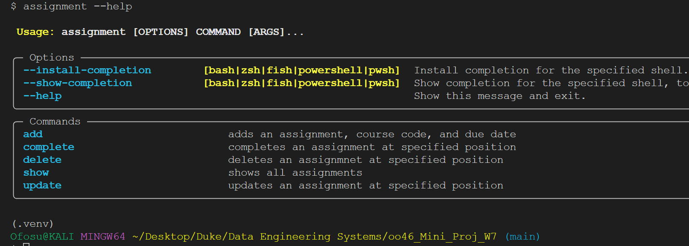
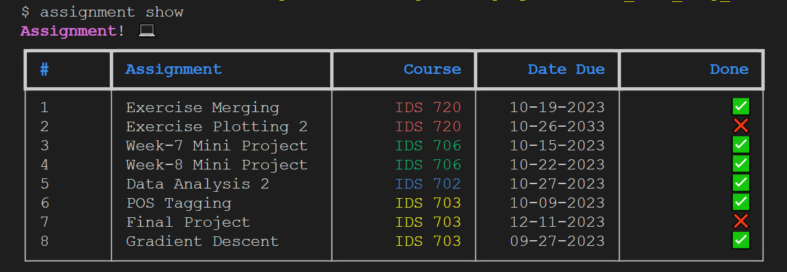

[][def]

# SQL Lab - Week 7 Mini project

## The current implementation of the Mini-project can be executed as follows:

1. Run pip install assignment-app==0.0.3 in your favorite terminal to install the app

2. Run assignment --help for usage commands. Example output:

## From the above depiction, the following commands can be run in the terminal:

1.  assignment add
2.  assignment update
3.  assignment complete
4.  assignment delete

## Mini-project deliverables:

1. [Remote Connection Module](https://github.com/nogibjj/oo46_Mini_Proj_W6/blob/main/mylib/mydbconn.py) => This module securely connects to an Azure SQL Server database in the cloud and returns a connection object along with a "success" message string. It relies on environment variables (Server Name, Database, User Name, Password) for this connection.

2. [Query Module](https://github.com/nogibjj/oo46_Mini_Proj_W6/blob/main/mylib/assignment_app/query.py) => The query module does the following:

   1. Creates the assignment database if it doesn't exist.

   2. It then performs all CRUD operations when called upon

3. [Main App Module](https://github.com/nogibjj/oo46_Mini_Proj_W7/blob/assignment_app/assignment.py) => This module can be thought of as the main entry point to the application. It interfaces the query module and the command line User Interface (UI).
   This is where all commands are executed.

4. [Class Model](https://github.com/nogibjj/oo46_Mini_Proj_W7/blob/assignment_app/model.py) => This is where the Assignment class is defined in an object oriented fashion.

[def]: https://github.com/nogibjj/oo46_Mini_Proj_W7/actions/workflows/cicd.yml
